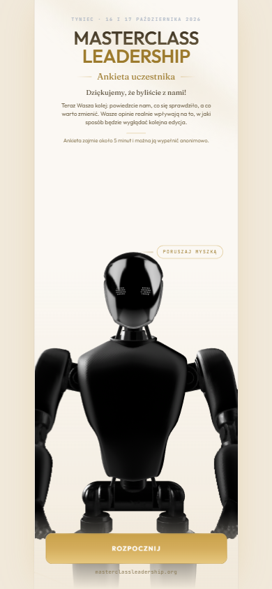
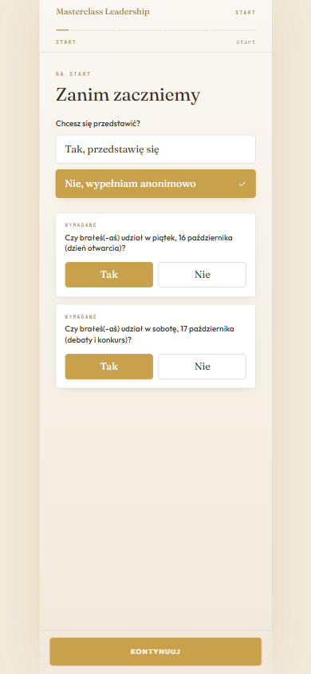
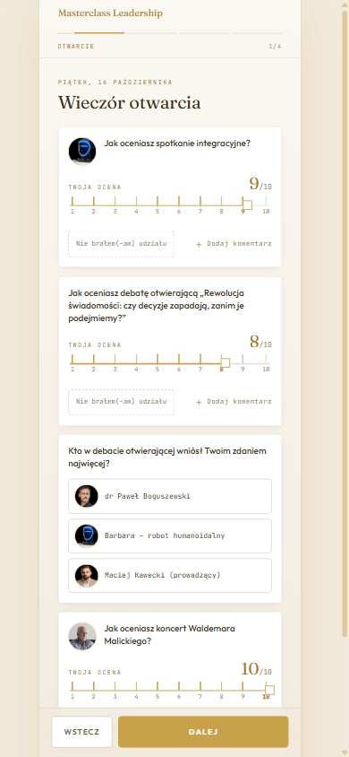
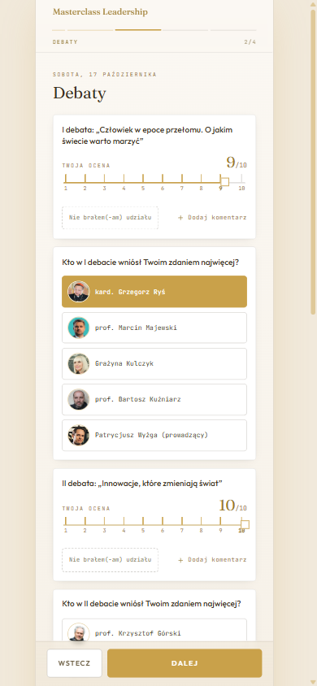
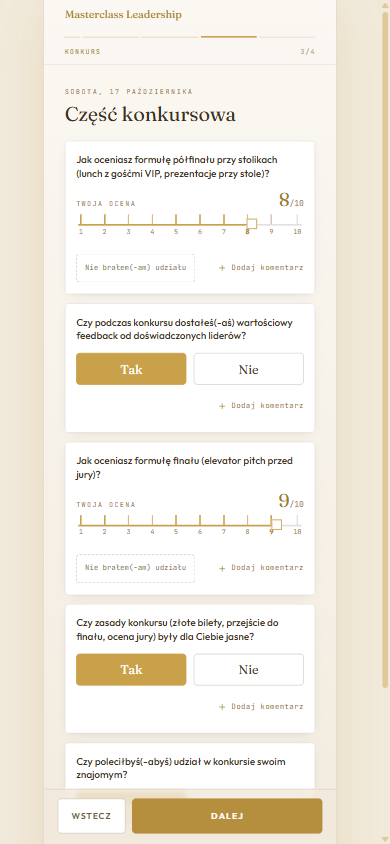
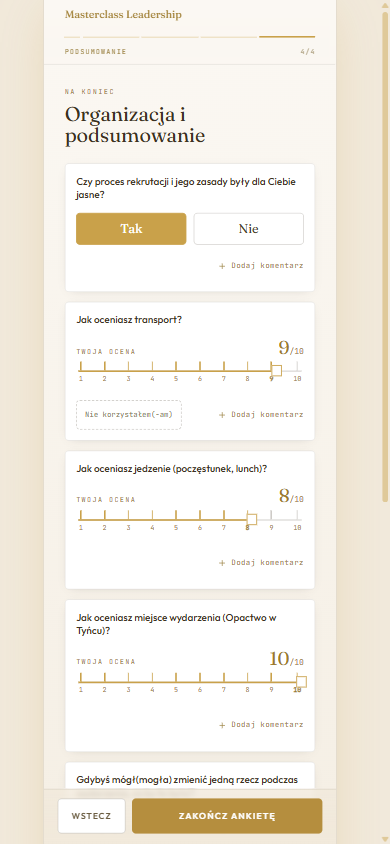
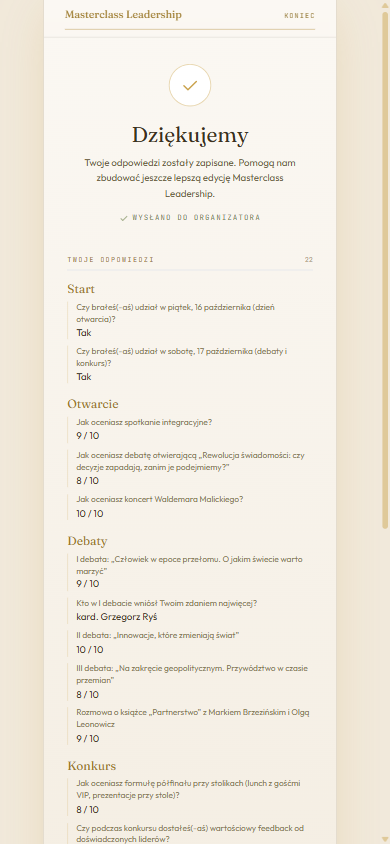

# Masterclass Leadership — Participant Feedback Survey

A mobile-first survey application built for **Fundacja CTN**, collecting structured
feedback from participants of Masterclass Leadership 2026 — a two-day leadership
conference held at Tyniec Abbey, Kraków (16–17 October 2026).

Participants scan a QR code, answer 26 questions across five sections on their phone, and their responses
land in the organiser's Google Sheet as a single row. No backend, no database, no
accounts.

<p align="center">
  
</p>

---

## Context

I built this application as a volunteer for **Fundacja CTN**, the foundation behind
Masterclass Leadership, during my scholarship with the **Rafał Brzoska Foundation**.

Masterclass Leadership brings together young leaders and established figures from
science, business, culture and public life — among them Cardinal Grzegorz Ryś,
former Prime Minister Hanna Suchocka, Grażyna Kulczyk, and Professor Krzysztof
Górski of NASA JPL. The event includes three debates, a start-up pitch competition
with prizes funded by the foundation, and an evening programme.

Previous editions collected feedback on paper. The forms came back half-filled,
the handwriting was hard to read, and transcribing them took days. This application
replaces that process.

---

## Screens

| | | |
|:--:|:--:|:--:|
|  |  |  |
| **Attendance & identity**<br/>Participants choose whether to sign their response or stay anonymous. Attendance answers decide which sections appear later. | **Rating scales**<br/>Drag or tap a 1–10 ruler. Anyone who missed a session marks it instead of guessing a score. | **Speaker selection**<br/>Portrait tiles make the choice concrete — no dropdowns full of names. |
|  |  |  |
| **Competition**<br/>Yes/no questions about the pitch format, each with an optional comment. | **Open questions**<br/>Three prompts at the end, only the last one required. | **Confirmation**<br/>Explicit proof the response reached the organiser, plus a full read-back of what was submitted. |

---

## What it does

**Adapts to the participant.** Someone who only attended Saturday never sees Friday's
questions. Sections and individual questions appear based on earlier answers, so
nobody is asked to rate an event they missed.

**Survives a bad connection.** Tyniec Abbey has thick stone walls and patchy mobile
coverage. Answers are written to `localStorage` as they are typed, the survey resumes
exactly where it left off after a refresh, and failed submissions are queued and
retried automatically.

**Reports honestly.** The confirmation screen distinguishes *saved to the organiser's
sheet* from *queued locally* — it never claims success it cannot verify. An earlier
version used `fetch` with `no-cors`, which silently swallowed every failure; that was
replaced with a real response check.

**Reads back what was submitted.** Participants see a full summary of their answers on
the closing screen, which catches accidental taps before they become data.

**Keeps the sheet stable.** The Apps Script matches answers to columns by question ID,
not position, so reordering the survey never scrambles historical data.

---

## How it works

```
Participant's phone                Google Apps Script            Google Sheet
─────────────────────              ──────────────────            ────────────
 React SPA (static)                 Web App endpoint              One row per
 answers → localStorage    POST     token check                   response,
 offline queue + retry    ──────▶   LockService (serialised)  ──▶ columns matched
                          JSON      column matching by ID          by question ID
                          ◀──────
                          {ok:true}
```

The entire front end is static — Vite builds it to `dist/` and Vercel serves it from a
CDN. The only moving part is a ~500-line Apps Script bound to the organiser's
spreadsheet, which authenticates each request with a shared token, serialises concurrent
writes with `LockService`, and caches the header row to avoid re-reading it on every
submission.

Load testing showed **100 out of 100 concurrent submissions saved** after the script was
optimised. Beyond roughly 1.5 writes per second the script rejects extra requests with
an explicit `queue full` response — which the app treats as a retryable failure rather
than reporting a false success.

---

## Tech stack

| | |
|---|---|
| **Front end** | React 18, TypeScript, Vite |
| **Styling** | Tailwind CSS, Framer Motion |
| **3D** | Spline (lazy-loaded, with a static poster fallback) |
| **Backend** | Google Apps Script Web App |
| **Storage** | Google Sheets |
| **Hosting** | Vercel |

No state management library, no routing library, no UI kit. Navigation is hash-based
with an intercepted History API, so the browser's back button moves one section back
rather than jumping to wherever the user came from.

---

## Getting started

```bash
npm install
npm run dev          # http://localhost:5190
```

To connect a Google Sheet, copy `.env.example` to `.env.local` and fill in the two
values from the Apps Script deployment:

```
VITE_ARKUSZ_URL=https://script.google.com/macros/s/.../exec
VITE_ARKUSZ_TOKEN=your-shared-secret
```

Without them the app runs fine — it simply skips the submission step, which is useful
for local development.

---

## Commands

| Command | What it does |
|---|---|
| `npm run build` | Production build into `dist/` |
| `npm run columns` | Regenerates the column list inside the Apps Script from `ankieta.json` |
| `npm run columns:excel` | Exports the sheet layout as `.xlsx` for the organisers |
| `npm run test:script` | Runs the Apps Script logic locally against a mocked Google API — 54 assertions, no network |
| `npm run test:scenarios` | Walks 25 filling scenarios end to end |
| `npm run test:fields` | Submits two rows filling every field, to verify column alignment |
| `npm run test:load` | Load test with concurrent submissions |
| `npm run test:throughput` | Measures sustained writes-per-second before the sheet starts rejecting |
| `npm run test:connection` | Sends a single test row to the live sheet |
| `npm run questions:to-excel` | Exports the questions to Excel for non-technical editing |
| `npm run questions:from-excel` | Imports edited questions back |
| `npm run example-sheet` | Generates a sample results sheet to show organisers |

---

## Editing the survey

`src/data/ankieta.json` is the single source of truth. Question types are `skala`
(1–10), `tak_nie` (yes/no), `jeden_wybor` (single choice, optionally with portraits),
`wiele_wyborow` and `tekst`.

A question can carry `komentarz: true` for an optional comment field, `wymagane: true`
to block progress until answered, `nieobecnosc: true` to offer "I wasn't there", and
`pokaz_jesli` to make it conditional on an earlier answer.

After changing questions, run `npm run columns` so the Apps Script column list stays in
sync with what the app actually sends. A test asserts the two match character for
character — if they drift apart, the suite fails.

The field names in `src/data/typy.ts` that mirror `ankieta.json`'s own keys (`tytul`,
`tresc`, `opcje`, `pokaz_jesli`, and so on) are deliberately left in Polish — they are
literal JSON keys, not just labels, so renaming them would break parsing.

---

## Testing

The Apps Script runs inside a mocked Google environment (`SpreadsheetApp`,
`LockService`, `CacheService`), so its logic is tested without touching a real
spreadsheet or the network:

```
$ npm run test:script
=== Wynik: 54 zdanych, 0 oblanych ===
```

Coverage includes concurrent writes, stale cache recovery, duplicate submissions from
the same device, bot honeypot rejection, wrong tokens, and column alignment against the
live question set.

---

## Repository layout

```
src/
  components/
    survey/        SurveyFlow, AnswerWidgets, section navigation
    robot/         isolated Spline 3D scene
    ui/            buttons, icons, background
  data/ankieta.json   the survey itself
  lib/submit.ts       submission, retry and offline queue
apps-script/
  Kod.gs              the Google Apps Script (template)
scripts/              tests, generators, load testing
docs/screenshots/     the images in this README
```

---

## Notes

The interface is in Polish, since that is the language of the event — every string a
participant sees on screen, and the survey content in `ankieta.json`, stays untouched.
Code, comments, and this documentation are in English.

Built pro bono for Fundacja CTN, 2026.
